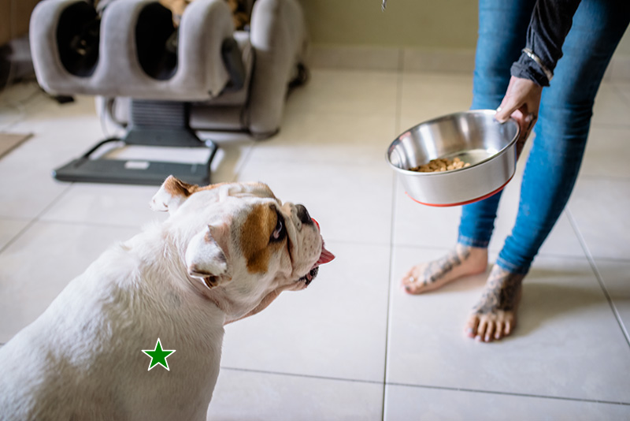
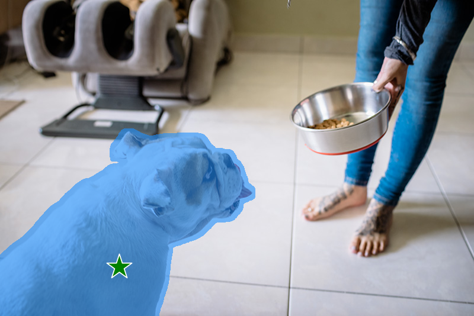
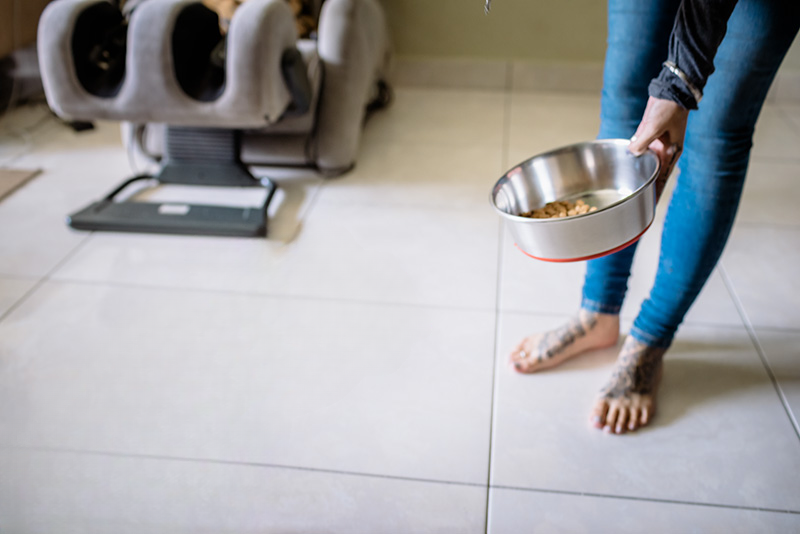

<p align="center">
  
</p>

# Inpaint Anything: Segment Anything Meets Image Inpainting
Inpaint Anything can inpaint anything in **images**, **videos** and **3D scenes**!
- Authors: Tao Yu, Runseng Feng, Ruoyu Feng, Jinming Liu, Xin Jin, Wenjun Zeng and Zhibo Chen.
- Institutes: University of Science and Technology of China; Eastern Institute for Advanced Study.
- [[Paper](https://arxiv.org/abs/2304.06790)] [[Website](https://huggingface.co/spaces/InpaintAI/Inpaint-Anything)] [[Hugging Face Homepage](https://huggingface.co/InpaintAI)]
<p align="center">
  
</p>

TL; DR: Users can select any object in an image by clicking on it. With powerful vision models, e.g., [SAM](https://arxiv.org/abs/2304.02643), [LaMa](https://arxiv.org/abs/2109.07161) and [Stable Diffusion (SD)](https://arxiv.org/abs/2112.10752), **Inpaint Anything** is able to remove the object smoothly (i.e., *Remove Anything*). Further, prompted by user input text, Inpaint Anything can fill the object with any desired content (i.e., *Fill Anything*) or replace the background of it arbitrarily (i.e., *Replace Anything*).

## 📜 News
[2023/9/15] [Remove Anything 3D](#remove-anything-3d) code is available!\
[2023/4/30] [Remove Anything Video](#remove-anything-video) available! You can remove any object from a video!\
[2023/4/24] [Local web UI](./app) supported! You can run the demo website locally!\
[2023/4/22] [Website](https://huggingface.co/spaces/InpaintAI/Inpaint-Anything) available! You can experience Inpaint Anything through the interface!\
[2023/4/22] [Remove Anything 3D](#remove-anything-3d) available! You can remove any 3D object from a 3D scene!\
[2023/4/13] [Technical report on arXiv](https://arxiv.org/abs/2304.06790) available!

## 🌟 Features
- [x] [**Remove** Anything](#remove-anything)
- [x] [**Fill** Anything](#fill-anything)
- [x] [**Replace** Anything](#replace-anything)
- [x] [Remove Anything **3D**](#remove-anything-3d) (<span style="color:red">🔥NEW</span>)
- [ ] Fill Anything **3D**
- [ ] Replace Anything **3D**
- [x] [Remove Anything **Video**](#remove-anything-video) (<span style="color:red">🔥NEW</span>)
- [ ] Fill Anything **Video**
- [ ] Replace Anything **Video**


## 💡 Highlights
- [x] Any aspect ratio supported
- [x] 2K resolution supported
- [x] [Technical report on arXiv](https://arxiv.org/abs/2304.06790) available (<span style="color:red">🔥NEW</span>)
- [x] [Website](https://huggingface.co/spaces/InpaintAI/Inpaint-Anything) available (<span style="color:red">🔥NEW</span>)
- [x] [Local web UI](./app) available (<span style="color:red">🔥NEW</span>)
- [x] Multiple modalities (i.e., image, video and 3D scene) supported (<span style="color:red">🔥NEW</span>)

<!-- ## Updates
| Date | News |
| ------ | --------
| 2023-04-12 | Release the Fill Anything feature | 
| 2023-04-10 | Release the Remove Anything feature |
| 2023-04-10 | Release the first version of Inpaint Anything | -->

## <span id="remove-anything">📌 Remove Anything</span>


<!-- <table>
  <tr>
    <td></td>
    <td></td>
    <td></td>
  </tr>
</table> -->

<p align="center">
    
</p>


**Click** on an object in the image, and Inpainting Anything will **remove** it instantly!
- Click on an object;
- [Segment Anything Model](https://segment-anything.com/) (SAM) segments the object out;
- Inpainting models (e.g., [LaMa](https://advimman.github.io/lama-project/)) fill the "hole".

### Installation
Requires `python>=3.8`
```bash
python -m pip install torch torchvision torchaudio
python -m pip install -e segment_anything
python -m pip install -r lama/requirements.txt 
```
In Windows, we recommend you to first install [miniconda](https://docs.conda.io/en/latest/miniconda.html) and 
open `Anaconda Powershell Prompt (miniconda3)` as administrator.
Then pip install [./lama_requirements_windows.txt](lama_requirements_windows.txt) instead of 
[./lama/requirements.txt](lama%2Frequirements.txt).

### Usage
Download the model checkpoints provided in [Segment Anything](./segment_anything/README.md) and [LaMa](./lama/README.md) (e.g., [sam_vit_h_4b8939.pth](https://dl.fbaipublicfiles.com/segment_anything/sam_vit_h_4b8939.pth) and [big-lama](https://disk.yandex.ru/d/ouP6l8VJ0HpMZg)), and put them into `./pretrained_models`. For simplicity, you can also go [here](https://drive.google.com/drive/folders/1ST0aRbDRZGli0r7OVVOQvXwtadMCuWXg?usp=sharing), directly download [pretrained_models](https://drive.google.com/drive/folders/1wpY-upCo4GIW4wVPnlMh_ym779lLIG2A?usp=sharing), put the directory into `./` and get `./pretrained_models`.

For MobileSAM, the sam_model_type should use "vit_t", and the sam_ckpt should use "./weights/mobile_sam.pt".
For the MobileSAM project, please refer to [MobileSAM](https://github.com/ChaoningZhang/MobileSAM)
```
bash script/remove_anything.sh

```
Specify an image and a point, and Remove Anything will remove the object at several points.
```bash
python remove_anything.py \
    --input_img path/to/your/image \
    --coords_type key_in \
    --point_coords "[[580, 250], [580, 50], [700, 350]]" \
    --point_labels "[1, 1, 1]" \
    --dilate_kernel_size 15 \
    --output_dir ./results \
    --sam_model_type "vit_h" \
    --sam_ckpt ./pretrained_models/sam_vit_h_4b8939.pth \
    --lama_config ./lama/configs/prediction/default.yaml \
    --lama_ckpt ./pretrained_models/big-lama
```

Specify an image and choose the objects you want to remove. The Remove Anything will remove the object at several points.
```bash
python remove_anything.py \
    --input_img path/to/your/image \
    --coords_type click \
    --dilate_kernel_size 15 \
    --output_dir ./results \
    --sam_model_type "vit_h" \
    --sam_ckpt ./pretrained_models/sam_vit_h_4b8939.pth \
    --lama_config ./lama/configs/prediction/default.yaml \
    --lama_ckpt ./pretrained_models/big-lama
```

You can change `--coords_type key_in` to `--coords_type click` if your machine has a display device. If `click` is set, after running the above command, the image will be displayed. 

(1) Use *left-click* to record the coordinates of the positive class;

(2) Use *right-click* for negative class; 

(3) Use *middle-click* to finish the selection.